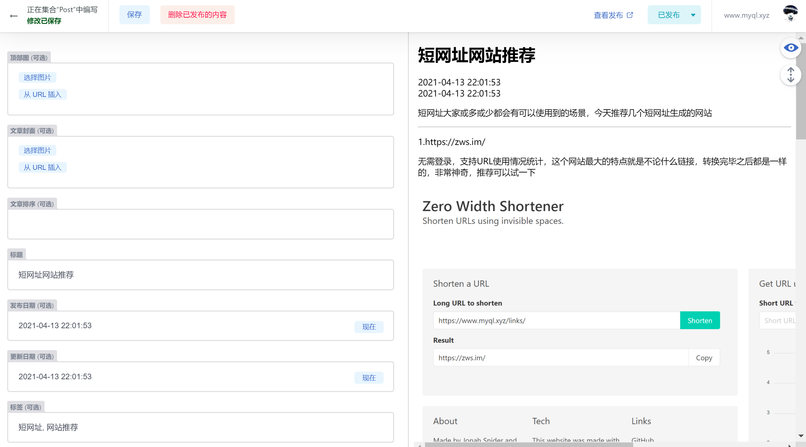
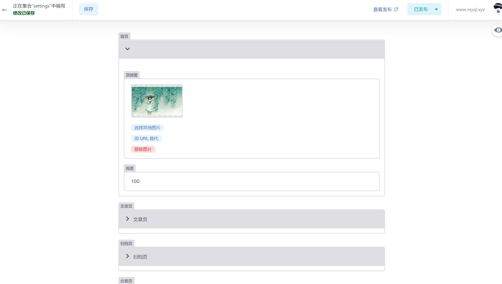

# hexo-blog-netlify

## 介绍

使用 [Hexo 6.2.0](https://hexo.io/) 和 [Netlify CMS](https://github.com/netlify/netlify-cms) 构建的示例站点

使用子模块方式，目前内置 [next主题 v8.12.2](https://github.com/next-theme/hexo-theme-next) | [fluid主题 v1.9.2](https://github.com/fluid-dev/hexo-theme-fluid) | [cards主题 1.3.1](https://github.com/ChrAlpha/hexo-theme-cards)

默认启用了 [fluid主题](https://github.com/next-theme/hexo-theme-next) ，如要切换主题请在 [_config.yml](https://github.com/leicancun/hexo-netlify/blob/main/_config.yml) 更改 `theme: fluid` 中 `fluid` 改为你需要的主题名称

> 注意，默认仅配置了 fluid 主题，其他主题不支持在线修改主题项目，如切换主题，请自行修改 `admin>config.yml`

更多配置请查看对应主题自行修改

## 效果预览

支持在线修改主题配置

[后台管理预览](https://qwqmiao.cf/admin/)

### Netlify CMS 编辑器工作流程

已在存储库中设置了 Netlify CMS `admin` 面板。您可以通过“ yourwebsite.com/admin”（例如“ localhost：4000 / admin”）访问它。**如提示配置错误请写死路径 `/admin/`**，如"yourwebsite.com/admin/"。
要了解有关配置的更多信息，请查看 [Netlify CMS docs](https://www.netlifycms.org/docs/intro/)。

## 食用方案

详细介绍文章请查看 👉 [Hexo Netlify CMS:在线编辑博客文章和配置](https://www.myql.xyz/post/e00ab0f6/)

### 部署到 Netlify （推荐）

使用以下部署按钮启动并运行您自己的存储库副本：

部署到 Netlify 按钮会将此存储库的副本克隆到您自己的 GitHub 或 GitLab 帐户。

### 部署到 Vercel （需自行修改）

需要自己修改并配置 `admin>codfig.yml` 才能正常使用 `netlify cms`

具体参考 

* 👉 [ublabs/netlify-cms-oauth: Use Netlify CMS for sites hosted on Vercel.](https://github.com/ublabs/netlify-cms-oauth)

* 👉 [GitHub | Netlify CMS | Open-Source Content Management System](https://www.netlifycms.org/docs/github-backend/)

## 待改进

~~由于对 `css` 不是熟悉，尚未配置页面自适应，编辑界面下预览效果不佳，手机等设备显示效果差，等待优化。~~

目前对图片并没有自适应，在手机上显示的效果也不算好，因为能力有限折腾了很久没弄明白，官方文档在这里 👉 [点我查看](https://www.netlifycms.org/docs/customization/)
如果能有大佬能帮助我就更好了，十分欢迎各位大佬

### 参考：

https://github.com/lunaceee/hexo-material-netlify
